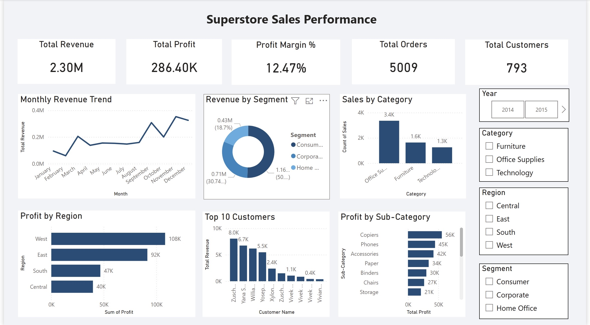

# Superstore Sales Performance Dashboard

## Project Overview
This project analyzes sales performance using Power BI.

## Dataset Overview
- 9,000+ transaction records
- 5,009 unique orders
- 793 customers

## Tools Used
- Power BI
- Power Query
- DAX (SUM, DISTINCTCOUNT, DIVIDE)

## Key Insights
- Total Revenue: 2.30M
- Profit Margin: 12.47%
- West region generated highest profit (108K)
- Strong year-end revenue growth

## Dashboard Preview
  
 
